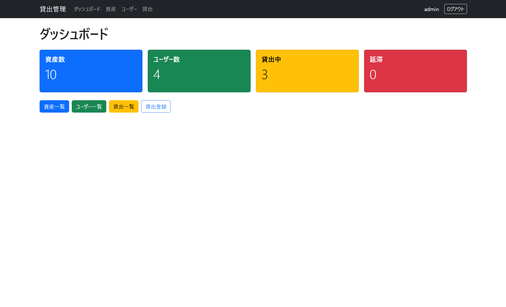
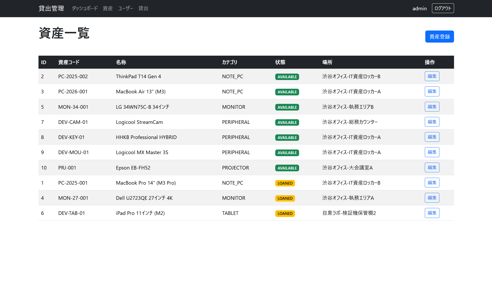
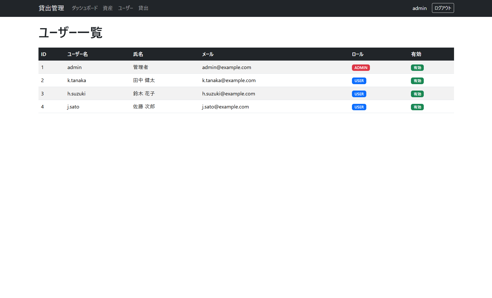
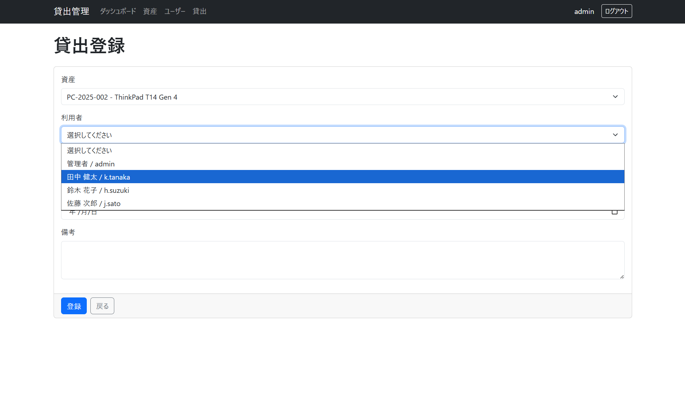
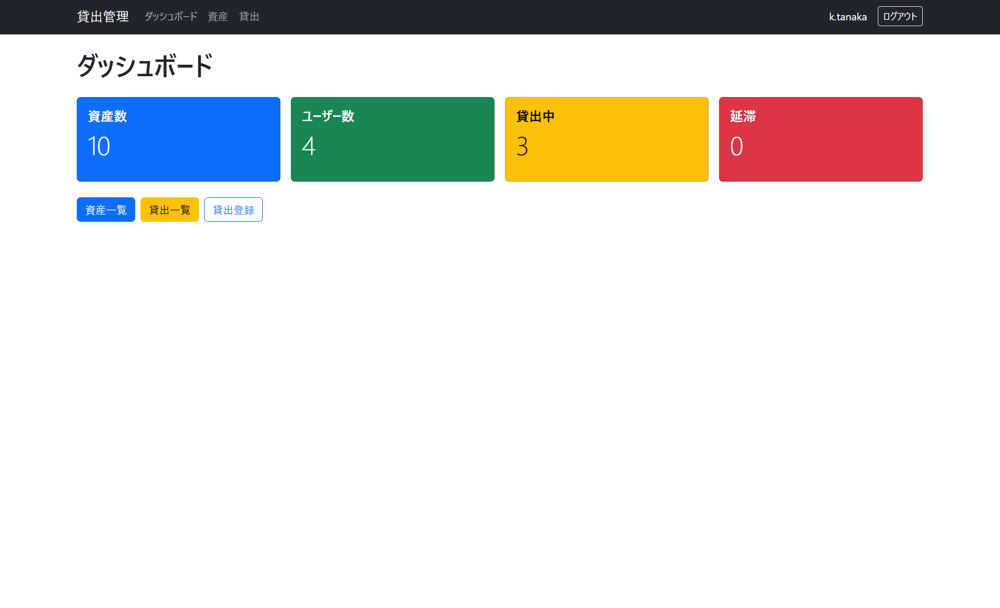
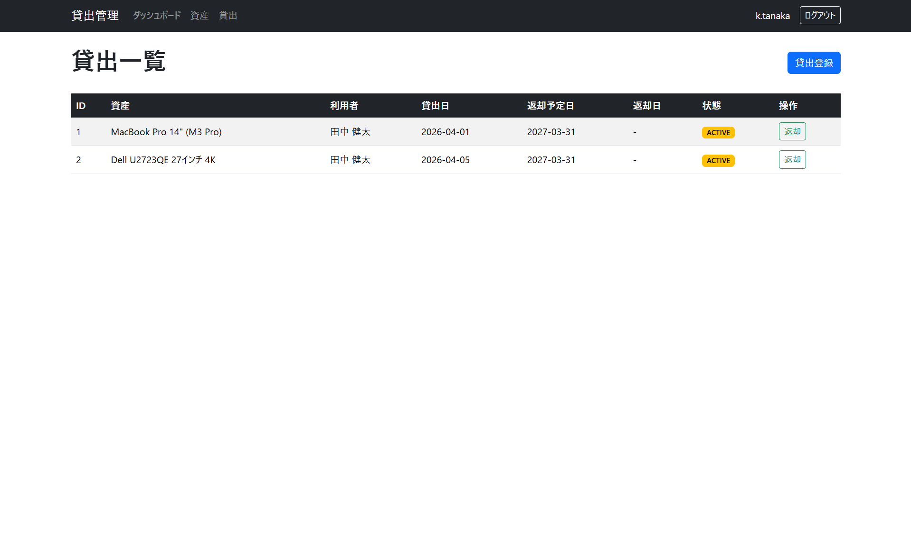
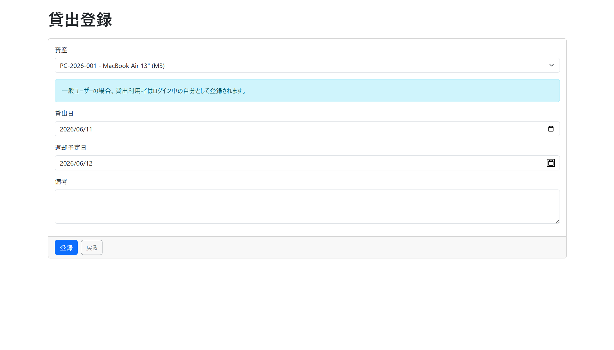
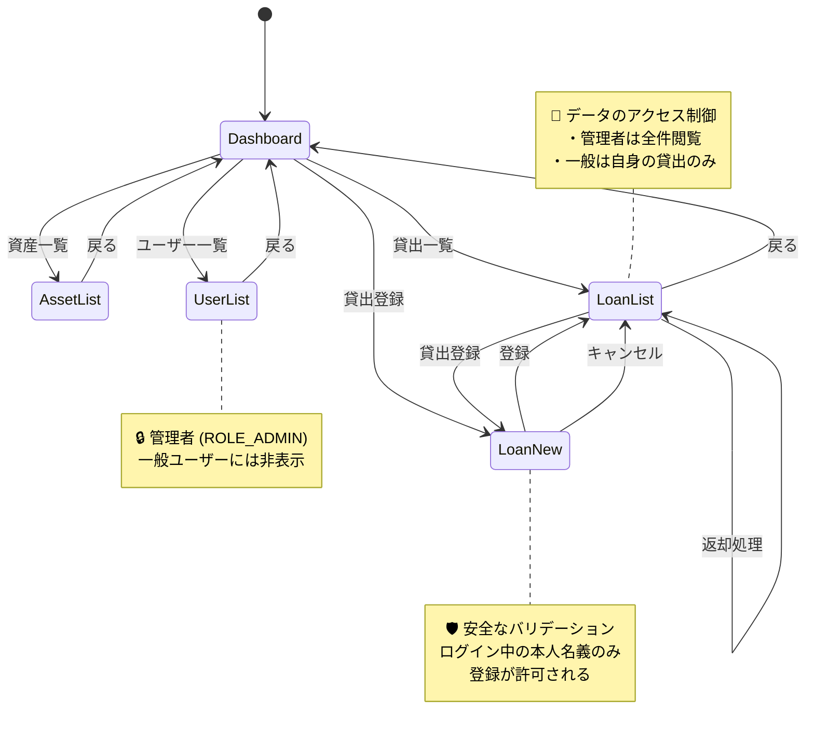

# 貸出管理システム (Asset Loan Management System)

社内物品や書籍などの貸出・返却業務を効率化するためのバックエンドシステムです。
ドメイン駆動設計（DDD）の思想を取り入れ、ビジネスルールの堅牢性と変更への強さを意識して開発しています。

⚠️ Note: 本プロジェクトは現在アクティブに開発中のプロトタイプです。一部の機能やCIパイプラインは構築途中のため、予告なく仕様が変更される場合があります。

---

## 📸 画面イメージ（マルチユーザー・認可制御）
本プロジェクトでは、Spring Security（または認可ロジック）による権限管理と、業務の状況を俯瞰できる簡易ダッシュボード機能を実装しています。

### 1. 管理者用画面（ダッシュボード）
<table border="0">
  <tr>
    <td></td>
    <td> </td>
  </tr>
  <tr>
    <td> </td>
    <td> </td>
  </tr>
</table>

* **サマリーバッジ機能:** 画面上部に「総資産数」「貸出中」などのリアルタイム集計バッジを表示。ドメイン層の状態定義と連動し、システム全体の稼働状況をひと目で把握できます。
* **フルアクセス権限:** ユーザー一覧や資産の全件管理など、管理者専用のコンポーネントが認可制御によって正しく表示されます。

### 2. 一般ユーザー用画面

    
    
    

* **最小権限の原則（PoLP）:** 認可制御により、一般ユーザーには不要な管理用メニューや機密項目が非表示となり、自身の貸出・返却リクエストに特化したシンプルなUIに切り替わります。

---

### 🗺️ 画面遷移図・認可コントロール
本アプリケーションの画面遷移と、Role（権限）によるアクセス制御の定義です。

---

## 🚀 本プロジェクトのこだわりポイント

1. **ドメイン駆動設計（DDD）による徹底したカプセル化**
   * 貸出可否の判定や期限超過ペナルティなどの複雑な業務ルールを、DBや画面の都合から完全に切り離し、ドメイン層（Entity）に閉じ込めました。これにより、仕様変更に強い堅牢な設計を実現し、**Domain層のブランチカバレッジ（C1）において初期フェーズ100%を達成**しています。

2. **最新LTS（Java 21）のパラダイムを活用したガード句**
   * Java 21のモダンな構文（Pattern Matching for switch 等）を積極的に採用。不正なデータや異常な状態遷移をドメイン層の入り口で確実にブロックする、安全かつ可読性の高い「ガード句」を実装しています。

3. **堅牢性を担保するアーキテクチャ設計思想（今後実装予定）**
   * **「べき等性」への配慮（実装済）:**
     Webアプリケーション特有のトラブル（ボタン連打による二重送信など）を防ぐため、資産の返却処理等において、2回目以降の同じリクエストが送られてもシステムがクラッシュ・誤動作しない「べき等」な状態遷移の設計を順次組み込んでいきます。
   * **GitHub Actionsによる品質の自動検証（開発予定）:**
     今後の機能拡張を安全かつ高速に行うため、CI（継続的インテグレーション）を導入予定です。Pull Request作成時に自動テスト（パス率100%検証）およびJaCoCoによるカバレッジチェックが走るパイプラインの構築を進めています。

---

## 🛠 技術スタック

| 分類           | 技術・ツール                       | 状態 / 備考                         |
|:-------------|:-----------------------------|:--------------------------------|
| **Backend**  | Java 21 / Spring Boot 3.5.14 | 主要ロジック実装                        |
| **Build**    | Maven                        | 依存関係管理 / Maven Wrapper (./mvnw) |
| **Database** | PostgreSQL                   | 開発環境: Docker Compose            |
| **Quality**  | JUnit 5 / AssertJ / JaCoCo   | 単体・結合テスト実行用                     |
| **CI/CD**    | GitHub Actions               | **近日期限でCI（自動テスト）構築予定**          |
| **Infra**    | Google Cloud (Cloud Run)     | **本番環境として検討中**                  |

---

## 📂 設計ドキュメント

本プロジェクトでは、コードを書く前の設計プロセスを重視し、ドメイン知識をドキュメントとして言語化・可視化しています。

* 📖 **[ユビキタス言語定義集](docs/domain/ubiquitous-lexicon.md)** - 資産貸出業務のドメイン知識を整理し、コードと認識を一致させるための用語集
* 📐 **[テスト方針・実績報告書](docs/testing/test-plan.md)** - テストピラミッドに基づく戦略、および品質実績のまとめ

### 🔄 状態遷移図
本アプリケーションにおける、主要な状態遷移の定義です。

* 📄 **[資産貸出状態遷移図](docs/domain/state-transition-diagrams/asset-state-transition-diagram.mmd)** - 業務の核となる、厳格な状態制御を可視化したメインの遷移図です。
* 📁 **その他詳細な状態遷移:**
  アプリ内の各エンティティに関する、より[細かい仕様は各ファイルを参照してください](docs/domain/state-transition-diagrams/)。

---

## 📊 テスト・品質実績

本プロジェクトでは「堅牢なドメインモデルの構築」を最優先とし、ビジネスロジックの核となるDomain層のEntityから徹底的にテストを拡充しています。現在はEntity層においてカバレッジ100%を達成しており、他レイヤーのテストも順次拡大予定です。

* **総合テスト成否:** PASS (100%)
* **対象レイヤー（Domain Entity）カバレッジ:** 

> 💡 テストコードの記述ルール、テストピラミッドに基づく各層（Domain/Application/Infrastructure）の今後のテスト方針は、設計ドキュメントの 📐 [テスト方針・実績報告書](docs/testing/test-plan.md) を参照してください。

---

## 🏁 ローカル環境の開発ガイド

### 🛠️ 前提条件
* **Docker / Docker Compose** がインストールされ、起動していること

### 🚀 起動手順
詳細な環境構築およびアプリケーションの起動手順については、以下のガイドを参照してください。
👉 **[ローカル環境起動ガイド](docs/local-setup.md)**