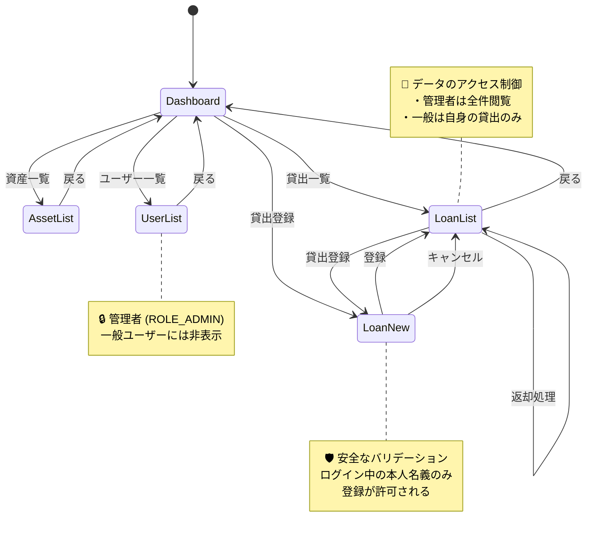

# 貸出管理システム (Asset Loan Management System)

[](https://www.oracle.com/java/)
[](https://spring.io/projects/spring-boot)
[](https://github.com/rohdfdk/asset-management/actions)

社内物品や書籍などの貸出・返却業務を効率化するためのバックエンドシステムです。
ドメイン駆動設計（DDD）の思想を取り入れ、ビジネスルールの堅牢性と変更への強さを意識して開発しています。

⚠️ Note: 本プロジェクトは継続的に改善しており、
機能およびCI設定はテストとレビューを通じて管理された形で更新しています。

- 👉 [デモを見る](#demo)
- 🛠️ [すぐ動かす](#quickstart)

---

## 🏗️ 設計上の取り組み

### Domain層への業務ルール集約
貸出可否や状態遷移などの業務ルールをDomain層に集約し、
Entityの状態変更を制御することで不正な遷移を防止しています。

### 状態遷移モデルによる資産管理
資産状態を以下の4状態で管理しています。
- AVAILABLE
- LOANED
- MAINTENANCE
- RETIRED

状態ごとに許可される操作を明確化し、ドメインルールとして一貫性を担保しています。

### Domain層の品質担保（テスト）
Domain層を中心にテストを実装し、ブランチカバレッジ100%を達成しています。

### CIによる継続的品質保証
GitHub Actionsによりテストと品質チェックを自動化し、
変更に対する品質劣化を防止しています。

---

## 📊 テスト・品質実績

本プロジェクトでは「堅牢なドメインモデルの構築」を最優先とし、ビジネスロジックの核となる Domain 層から徹底的にテストを拡充しています。

* **現在のステータス:** PASS (100%) ｜ 

現在は Domain Entity 層においてカバレッジ 100% を達成しており、他レイヤーのテストも順次拡大予定です。詳細なテストコードの記述ルールや各層のテスト方針については、[テスト方針・実績報告書](docs/testing/test-plan.md) を参照してください。

---

## 📸 画面イメージ 
<a id="demo"></a>
ロール（管理者 / 一般）に応じたメニューの出し分けと、業務状況を可視化するダッシュボードを実装しています。

### 1. 管理者用画面（フルアクセス権限）
* **特徴:** 全資産・全ユーザーの管理権限、およびシステム全体の稼働状況を集計するサマリーバッジを表示。

<table>
  <tr>
    <td><br><sub>ダッシュボード</sub></td>
    <td><br><sub>貸出申請画面</sub></td>
  </tr>
</table>

<details>
  <summary>🔍 他の管理者用画面（一覧系・2枚）を表示</summary>
  <br>
  <table>
    <tr>
      <td><br><sub>資産一覧画面</sub></td>
      <td><br><sub>ユーザー一覧画面</sub></td>
    </tr>
  </table>
</details>

---

### 2. 一般ユーザー用画面（最小権限の原則）
* **特徴:** 管理用メニューや機密項目を自動で非表示にし、自身の貸出・返却リクエストに特化したUI。

<table>
  <tr>
    <td><br><sub>ダッシュボード</sub></td>
    <td><br><sub>貸出申請画面</sub></td>
  </tr>
</table>

<details>
  <summary>🔍 一般ユーザー用の履歴画面を表示</summary>
  <br>
  <table>
    <tr>
      <td><br><sub>自分の貸出一覧</sub></td>
      <td></td> </tr>
  </table>
</details>

---

### 🗺️ 画面遷移図・認可コントロール
本アプリケーションの画面遷移と、Role（権限）によるアクセス制御の定義です。

---

## 🛠️ 技術スタック

| 分類       | 技術・ツール                       | 状態 / 備考                         |
|:---------|:-----------------------------|:--------------------------------|
| Backend  | Java 21 / Spring Boot 3.5.14 | 主要ロジック実装                        |
| Build    | Maven                        | 依存関係管理 / Maven Wrapper (./mvnw) |
| Database | PostgreSQL                   | 開発環境: Docker Compose            |
| Quality  | JUnit 5 / AssertJ / JaCoCo   | 単体・結合テスト実行用                     |
| CI/CD    | GitHub Actions               | CI（自動テスト）構築                     |
| Infra    | Google Cloud (Cloud Run)     | 💡 本番環境として検討中                   |

---

## 📂 設計ドキュメント

本プロジェクトでは、コードを書く前の設計プロセスを重視し、ドメイン知識をドキュメントとして言語化・可視化しています。

* [ユビキタス言語定義集](docs/domain/ubiquitous-lexicon.md)
  資産貸出業務のドメイン知識を整理し、コードと認識を一致させるための用語集。
* [テスト方針・実績報告書](docs/testing/test-plan.md)
  テストピラミッドに基づく戦略、および品質実績のまとめ。

### 🔄 状態遷移図
本アプリケーションにおける、主要な状態遷移の定義です。

* [資産貸出状態遷移図](docs/domain/state-transition-diagrams/asset-state-transition-diagram.mmd)
  業務の核となる、厳格な状態制御を可視化したメインの遷移図です。
* その他の各エンティティに関する詳細は[こちら](docs/domain/state-transition-diagrams/)

---

## 🏁 クイックスタート 
<a id="quickstart"></a>

本プロジェクトは、セキュリティ担保のため環境変数ファイル（`.env`, `application-local.yaml`）の設定が必要です。

```bash
# 1. リポジトリのクローンと移動
git clone https://github.com/rohdfdk/asset-management.git
cd asset-management

# 2. 環境変数の作成とDB起動
cp .env.example .env
make db-up

# 3. アプリケーションの起動
./mvnw spring-boot:run
```

⚙️ ステップごとの詳細・Windowsでの起動について
パスワードの設定値や、Windows（mvnw.cmd）での起動手順については、👉 **[ローカル環境起動ガイド](docs/local-setup.md)** を参照してください。

---