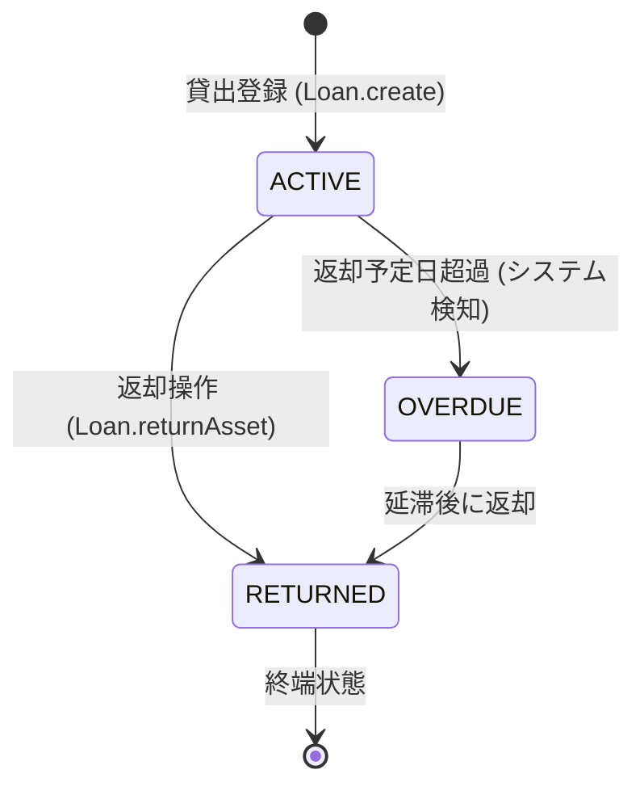

# ユビキタス言語定義集（Ubiquitous Lexicon）

本システム（貸出管理システム）における、対象ドメイン（資産貸出業務）の仕様とコードを一致させるための言葉の定義です。

> ⚠️ **設計に関する既存のIssueについて（暫定運用ルール）**
> 1. ドメイン語彙の移行について > 開発初期に識別子として Asset（資産） を採用しましたが、ドメイン知識の深化に伴い、より実態に即した Device（社内デバイス） へ変更すべきであると判断し、先行してIssueを起票しています。当面の運用として、コード上の正式語彙は Asset を正とし、Device は将来置換予定の用語として扱います。
> 2. 貸出インスタンス生成のファクトリ化について > 本定義集では貸出アクションの識別子を `Loan.create()`（静的ファクトリメソッド）として定義していますが、現在は暫定的に `new Loan()`（パブリックコンストラクタ）で実装されています。ビジネスルール（初期状態の強制など）をカプセル化するため、リファクタリング用のIssueを別途起票済みです。当面は `new Loan()` での生成を許容します。
> 3. 新規用語の追加プロセス > 実装中に定義集にないドメイン用語が必要となった場合は、独断で実装せず、必ずIssueまたはチャット上で合意形成を行ってから追記してください。
---

## 1. 主要エンティティ（実体）

| 用語（日本語） | 用語（英語） | コード上の識別子 | 定義・ビジネスルール |
|:--|:--|:--|:--|
| **貸出資産** | Asset | `Asset` | システムで管理され、貸出の対象となる物品（PC、周辺機器、書籍など）。 |
| **ユーザー** | User | `User` | 資産を借りる権利を持つユーザー。 |
| **貸出記録** | Loan | `Loan` | 誰が、何を、いつからいつまで借りているか（借りていたか）を管理する取引データ。 |

### 1.1 識別子ルール

- `Asset` は業務上の識別子として `assetCode` を持つ。  
- `assetCode` は必須かつ一意であり、英数字・ハイフン・アンダースコアのみ許可する。  
- 用語集・DB・API・UI はこの識別ルールを共通前提として扱う。

---

## 2. アクション・イベント（動詞）

> 英語表現の揺れを避けるため、本定義集では「貸出（する）」の英語を **Borrow** に統一する。

| 用語（日本語）    | 用語（英語）  | コード上の識別子             | 定義・ビジネスルール                                      |
|:-----------|:--------|:---------------------|:------------------------------------------------|
| **貸出（する）** | Borrow  | `Loan.create()`      | ユーザーが、利用可能（AVAILABLE）な状態の資産を借り、貸出記録が新規に生成されること。 |
| **返却（する）** | Return  | `Loan.returnAsset()` | 借りていた資産が手元に戻り、貸出記録に実際の返却日が記録されること。              |
| **期限超過**   | Overdue | `LoanStatus.OVERDUE` | 予定返却日を過ぎても返却されないとき、システム処理により期限超過状態へ遷移すること。      |

### 2.1 実行前提と責務（どこで担保するか）

- 新規貸出の前提条件：対象ユーザーが **期限超過（OVERDUE）貸出を保有していない** こと。  
- この前提条件は `Loan` 単体では完結できないため、**アプリケーションサービス／ドメインサービス層**で検証する。  
- `Loan` エンティティは、生成・返却・期限超過判定に関する単一取引内の整合性を担保する。

---

## 3. 状態（ステータス）

### 3.1 貸出状態（LoanStatus）

貸出記録（`Loan`）が持つ状態の定義。

- **ACTIVE（貸出中）:** 資産がユーザーに貸し出されており、まだ返却期限内、または返却手続きが完了していない状態。  
- **RETURNED（返却済み）:** 資産が正常に返却され、貸出取引が完了した状態（終端状態）。  
- **OVERDUE（期限超過）:** 予定返却日を過ぎても返却が確認できない状態。

### 3.2 状態遷移ルール（要点）

- `ACTIVE -> RETURNED`: 返却操作により遷移する。  
- `ACTIVE -> OVERDUE`: 予定返却日超過をシステムが検知したタイミングで遷移する。  
- `OVERDUE -> RETURNED`: 期限超過後の返却により遷移する。  
- `RETURNED` は終端状態とし、以降の状態遷移は行わない。




### 3.3 「自動遷移」の運用タイミング

- 期限超過への自動遷移は、以下いずれかの運用で実現する（システム設計で採用方式を明示する）。
  - 日次バッチ処理
  - 定期ジョブ処理
  - 参照時評価（読み取り時に必要に応じて更新）

---

## 4. 用語運用ルール

- 会話・仕様書・コードレビューでは本定義集の語彙を優先する。  
- 新規用語の追加・変更時は、影響範囲（コード上識別子、DB、API、UI、テスト）を併記する。  
- 用語が複数候補ある場合は、主語視点と責務が曖昧にならない語を採用する。

---

## 変更履歴

- 2026/06/09: 新規作成（貸出、返却、期限超過の基本定義を追加）
- 2026/06/18: アクション（動詞）の定義に、「誰が」「どういう状態でなければ実行できないか」というビジネスルールを追記
- 2026/06/18: 用語揺れ（Borrow / Loan）を解消、責務所在（Service層）を明記、状態遷移ルールと自動遷移タイミングを追加
```